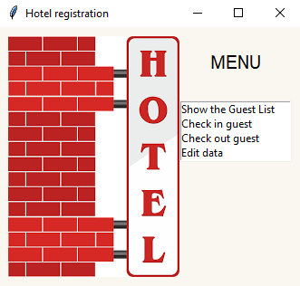
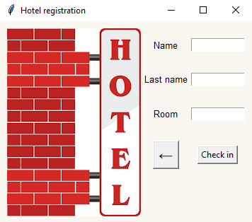

# Hotel Registration app
> This is a Python project that provides the main functions you would expect from a registration, such as possibiliby to check in or out guest.
allows to save guests data into a file, remove and edit guests data.

## Table of Contents
* [General Info](#general-information)
* [Technologies Used](#technologies-used)
* [Features](#features)
* [Screenshots](#screenshots)
* [Project Status](#project-status)
* [Room for Improvement](#room-for-improvement)

## General Information
The project allows to save entered data into a file. It also allows to show the guest list.

## Technologies Used
- Python 3.12

## Features
List the ready features here:

- Show Guest List
This feature print out the list of guests from saved file.

- Check in
This feature collects data from fulfilled boxes and saves into the file after clicking the "check in" button.

## Screenshots

<!-- If you have screenshots you'd like to share, include them here. -->

## Project Status
Project is: _in progress_

## Room for Improvement

To do:

- Add edit funcion
- Add check out function
- Add room status

